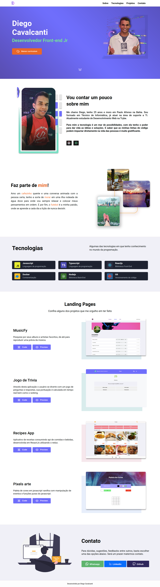

# Portfólio
  
## Objetivo: 
Prover uma aplicação que centraliza todas as informações refentes a contatos e projetos pessoais desenvolvidos. 

> **Preview:**
> 👉 [Recipes App](https://diegocti.vercel.app/)

## Habilidades: 

Neste projeto pude práticar e aprimorar meus conhecimentos em:

- **Javascript**
- **ReactJs** 
- **React Hook**
- **Figma** para design e layout da aplicação

## Sobre

## Tecnologia

As principais tecnologias que ultilizo em projetos

## Projetos:

Esta sessão visa mostrar os principais projetos dos quais eu me orgulho ter feito, retratando diferentes momentos de minha jornada. Cada projeto contém uma breve descrição, foto e dois botões de redirecionamento para o código e para o preview da aplicação.

## Contatos:

A sessão de contatos conta conta com botões de redirecionamento imediato para o Whtasapp, linkendin e github. Simples e de fácil acesso.

#### TheMealDB API

O [TheMealDB](https://www.themealdb.com/) é um banco de dados aberto, mantido pela comunidade, com receitas e ingredientes de todo o mundo.

#### The CockTailDB API

 A [The CockTailDB API](https://www.thecocktaildb.com/api.php) é bem similar (inclusive mantida pela mesma entidade) a TheMealDB API, só que focado em bebidas.

## Bibliotecas que contém neste projeto:
* **[ReactJS](https://pt-br.reactjs.org/)**
* **[Redux](https://redux.js.org/)**
* **[React Testing Library](https://testing-library.com/docs/react-testing-library/intro/)**

## Layout:

cebook.github.io/create-react-app/docs/troubleshooting#npm-run-build-fails-to-minify)
