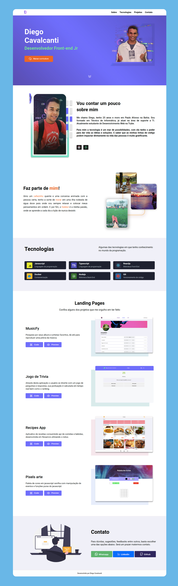

# Portfólio

Prover uma aplicação que centraliza todas as informações refentes a contatos e projetos pessoais desenvolvidos. 

> **Preview:**
> 👉 [Portifólio](https://diegocti.vercel.app/)

## Habilidades: 

Neste projeto pude práticar e aprimorar meus conhecimentos em:

- **Javascript**
- **ReactJs** 
- **React Hook**
- **Figma** para design e layout da aplicação

## Tecnologia

As principais tecnologias que ultilizo em projetos

## Projetos:

Esta sessão visa mostrar os principais projetos dos quais eu me orgulho ter feito, retratando diferentes momentos de minha jornada. Cada projeto contém uma breve descrição, foto e dois botões de redirecionamento para o código e para o preview da aplicação.

## Contatos:

A sessão de contatos conta conta com botões de redirecionamento imediato para o Whtasapp, linkendin e github. Simples e de fácil acesso.

## Bibliotecas que contém neste projeto:
* **[ReactJS](https://pt-br.reactjs.org/)**

## Layout:

