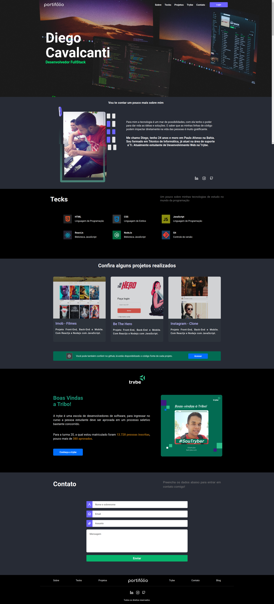

# Portifolio Diego Cavalcanti

O portifólio, foi desenvolvido como forma de por em prática meus conhecimentos em HTML e CSS, é uma página web que contém informações dobre mim, tecnologias em que estou estudando no momento, sessão de projetos já realizados e informações de contato. Para isto foi ultilizado css e html.

<h4 align="center"> 
	🚧  Portifolio Dev 🚀 Concluído  🚧
</h4>

### :hotsprings: Habilidades 

As seguintes habilidades foram ultilizadas na construção do projeto:

- Manipulação CSS
- Manipulação HTML

### 🛠 Tecnologias

As seguintes ferramentas foram usadas na construção do projeto:

- [Html](https://htmlreference.io/)
- [Css](https://developer.mozilla.org/pt-BR/docs/Web/CSS)
- [Vscode](https://code.visualstudio.com/)

### :dart: Principais ações

- [x] Sessão Sobre
- [x] Sessão Tecnologias
- [x] Sessão Projetos já realizados
- [x] Sessão Boas Vindas a trybe
- [x] Sessão Contato

### :movie_camera: Demonstração projeto pronto

<h1 align="center" >
  
</h1>

